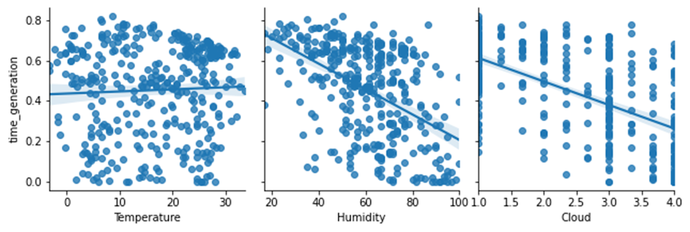

# 📋 동서발전 태양광 발전량 예측 AI 경진대회  (21. 4. 1. ~ 21. 7. 9)
- 소개 : 태양광 발전의 발전량 예측을 통한 원활한 전력 수급 계획이 가능하도록 기상 상황과 계절에 따른 일사량 데이터를 활용하여 인공지능 기반 태양광 발전량 예측 모델 개발
- 맡은 역할 : 데이터 전처리, 모델 개발

# 시계열 예측

태양광 발전 데이터
참고 - https://dacon.io/competitions/official/235720/codeshare/2488?page=1&dtype=recent
- 발전소 정보
- 발전소별 발전량
- 당진지역 발전소 동네 예보
- 당진지역 발전소 인근 기상 관측 자료
- 울산지역 발전소 동네 예보
- 울산지역 발전소 인근 기상 관측 자료

# Feature Engineering

- 월간 시간대별 에너지 발생량 평균 Heatmap

- 날씨 데이터 간 상관관계 분석

- 발전량과 날씨 데이터 상관관계 분석
