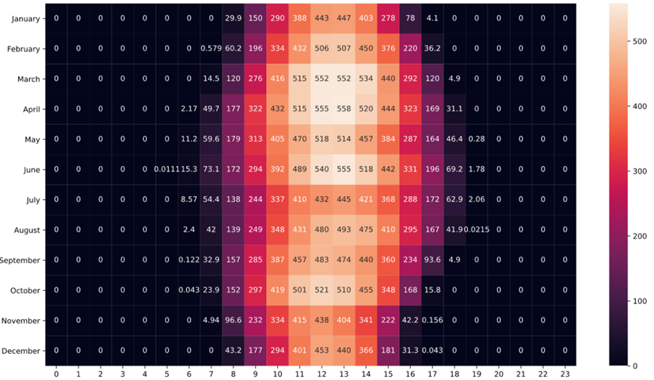

# 📋 동서발전 태양광 발전량 예측 AI 경진대회  (21. 4. 1. ~ 21. 7. 9)
- 소개 : 태양광 발전의 발전량 예측을 통한 원활한 전력 수급 계획이 가능하도록 기상 상황과 계절에 따른 일사량 데이터를 활용하여 인공지능 기반 태양광 발전량 예측 모델 개발
- 맡은 역할 : 데이터 전처리, 모델 개발

# 시계열 예측

태양광 발전 데이터
참고 - https://dacon.io/competitions/official/235720/codeshare/2488?page=1&dtype=recent
- 발전소 정보
- 발전소별 발전량
- 당진지역 발전소 동네 예보
- 당진지역 발전소 인근 기상 관측 자료
- 울산지역 발전소 동네 예보
- 울산지역 발전소 인근 기상 관측 자료

# Feature Engineering
- 월간 시간대별 에너지 발생량 평균 Heatmap
  
의외로 여름보다 봄에 에너지 발생량이 많다는 것을 알 수 있음  
 
- 날씨 데이터 간 상관관계 분석
  
 
 
- 발전량과 날씨 데이터 상관관계 분석
 Temperature 선의 기울기 값이 작은 것을 보아 발전량과 기온은 생각보다 큰 상관관계가 없다는 것을 알 수 있음 
오히려 습도와 구름량과의 상관관계가 있다는 것을 알 수 있음

- 학습 데이터 추가
  - 기존 데이터 2018년~2021년
  - 추가 데이터 2015년~2017년
  - 성능 향상 없음 (단순히 학습 데이터를 추가하는 것은 성능 향상이 없는듯)

- 23시 예보 데이터를 사용
  - 가장 최신화 된 데이터를 활용하는 것이 유리할 것이라 판단
  - 성능 소폭 상승

- 일조, 일사량이 태양광 발전량 예측에 도움이 될 것이라 판단
  - 하지만 기상청에서 일조, 일사량 예보를 제공해주지 않음
  - 365일 태양의 적위, 태양의 고도, 일출 시간, 일몰 시간, 직접 일사량, 대기 질량 값을 통해 이론적으로 일사량을 계산하는 공식을 활용하여 일사량 데이터를 추가하여 학습
  - 성능 소폭 상승

# Model
- LSTM
  - Score 15.6 정도로 성능이 좋지 않음 (Score가 낮을 수록 좋음)

- Light GBM
  - Score 9.1 정도로 성능이 준수함 (Baseline 모델)
  - Optuna(하이퍼 라미터 튜닝을 자동화 해주는 프레임워크)를 통해 Score 8.31 달성

# 부족했던 점
- 데이터 처리가 미흡하여 실수가 많았고 시간을 낭비하게 됨
- 모델을 다양하게 활용해보지 못함
